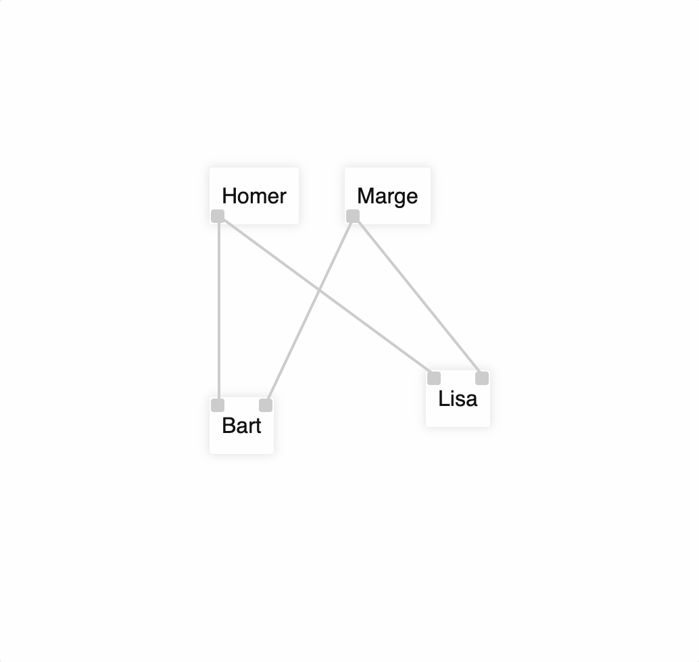

# flow-view

> is a visual editor for [Dataflow programming][dataflow_wikipedia]

<a href="http://fibo.github.io/flow-view/">
<div>Demo</div>

</a>

## Installation

### Using npm

With [npm](https://npmjs.org/) do

```bash
npm install flow-view
```

### Using a CDN

Try this in your HTML page

```html
<script type="importmap">
  { "imports": { "flow-view": "https://unpkg.com/flow-view" } }
</script>

<script type="module">
  import { defineFlowViewCustomElements } from "flow-view";

  addEventListener("load", () => {
    defineFlowViewCustomElements();
  });
</script>
```

## Usage

See [documentation and examples page](http://fibo.github.io/flow-view/).

## License

[MIT](http://fibo.github.io/mit-license)

[dataflow_wikipedia]: https://en.wikipedia.org/wiki/Dataflow_programming "Dataflow programming"
